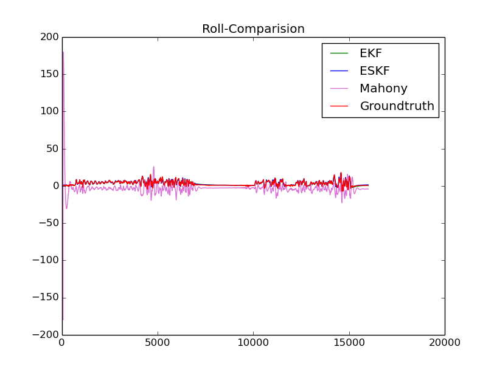
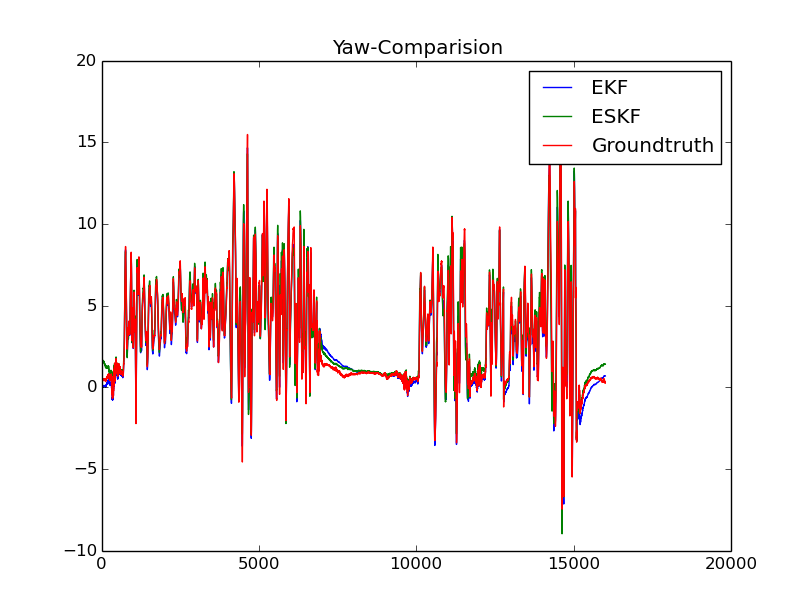
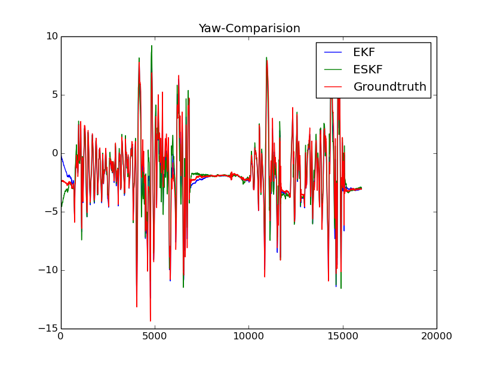
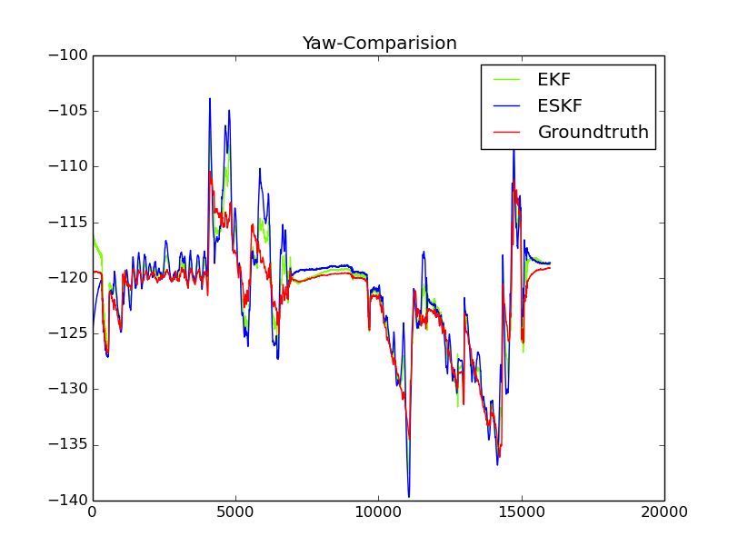

# IMU_Attitude_Estimator

This project is aimed at estimating the attitude of Attitude Heading and Reference System(AHRS). And the project contains three popular attitude estimator algorithms.
- Mahony's algorithm
- Extend Kalman Filter(EKF)
- Error State Kalman Filter(ESKF)

```DataSets.py``` for converting estimator data.    
```Allan_Analysis``` for Allan Variance analysis.

### Refrence
[1] [Mahony R, Hamel T, Pflimlin J M. Nonlinear complementary filters on the special orthogonal group[J]. IEEE Transactions on automatic control, 2008, 53(5): 1203-1218.](http://ieeexplore.ieee.org/stamp/stamp.jsp?tp=&arnumber=4608934)  
[2] [Pixhawk state estimation](https://pixhawk.org/_media/firmware/apps/attitude_estimator_ekf/ekf_excerptmasterthesis.pdf)  
[3] [Solà, Joan. Quaternion kinematics for the error-state Kalman filter[J]. 2017.](http://219.216.82.193/cache/4/03/www.iri.upc.edu/bbcd603c764cd75e76df0968d16bc022/kinematics.pdf)  
[4] [Trawny N, Roumeliotis S I. Indirect Kalman Filter for 3D Attitude Estimation[J]. 2005.](http://pdfs.semanticscholar.org/2c8e/95bc331024105cbde6f6918cda8493f263c8.pdf)

### Dependencies
- Eigen3.2.0
- glog
```
sudo apt-get install libgoogle-glog-dev
```
- [matplotlib-cpp](https://github.com/lava/matplotlib-cpp)

### Simple Test
Simple comparision among three methods. And the params of Mahony filter can be further tuned.

